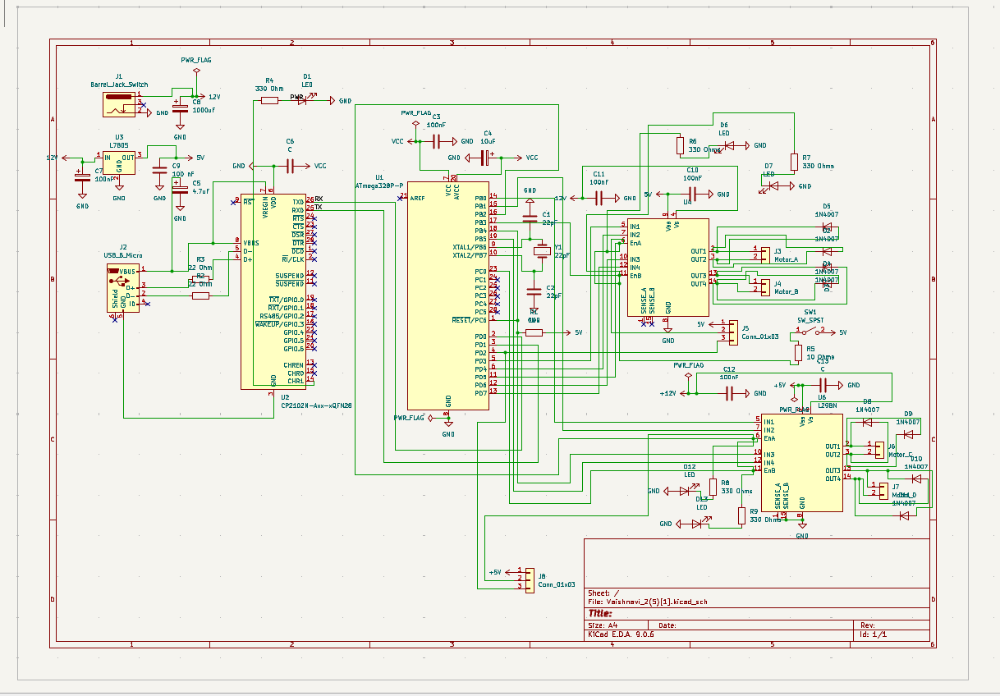
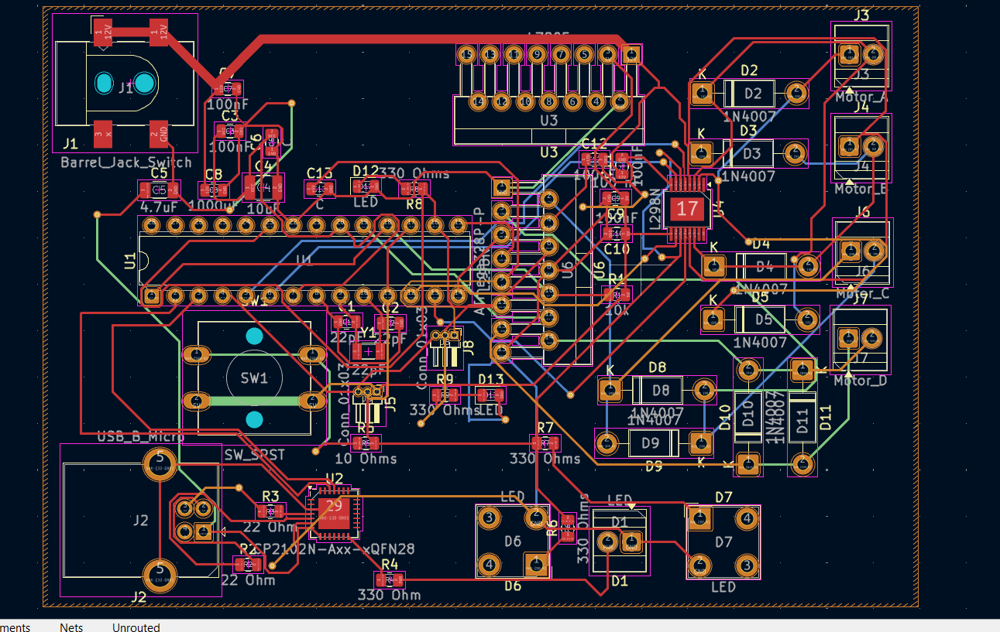

# Embedded Motor Control PCB

## 📌 Project Overview
This project presents a custom-designed PCB integrating an Arduino Uno and dual L298N motor drivers into a single compact board. The objective was to reduce system size, improve wiring efficiency, and enhance reliability.

## 🚀 Key Features
- Unified PCB integrating Arduino Uno + Dual L298N drivers
- 60% reduction in overall system footprint
- Optimized routing for power and motor driver traces
- Compact and modular embedded system design

## 🛠 Tools Used
- KiCad (Schematic & PCB Layout)
- Fusion 360
- Embedded hardware testing

## 📷 Project Preview

### 🔹 Schematic

### 🔹 PCB Layout

### 🔹 3D View

## 📂 Repository Contents
- KiCad schematic files
- PCB layout files
- Project PDFs
- 3D render images

## 🎯 Learning Outcomes
- PCB schematic capture
- Layout optimization
- Power routing techniques
- Hardware debugging and board bring-up
